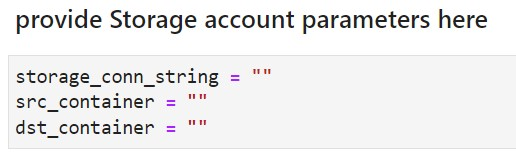
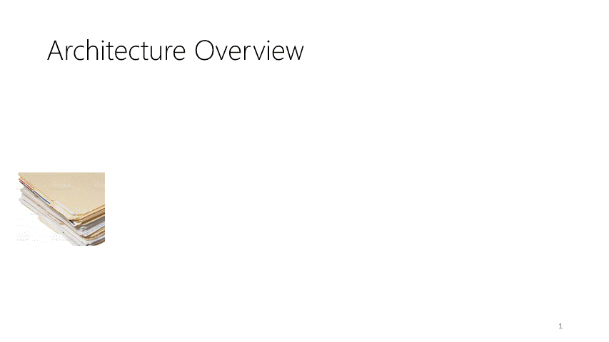

# Form-Recognizer-Accelerator

This solution accelerator helps in clustering / segregating data into templates. Data once segregated to templates can be used from training Form Recognizer "Train with Labels" models.

## Input Data

- This solution expects input data to be placed on Azure Blob Storage containers
- It accepts data in pdf, png, tif and jpeg formats

## Pre-requisites

- **Azure subscription** (If you don't already have a subscription, create a [free account](https://azure.microsoft.com/free/?WT.mc_id=A261C142F) before you begin).
- **Azure Blob Storage account** (If you don't have an Azure Storage account, refer to the [quickstarts](https://docs.microsoft.com/en-us/azure/storage/blobs/storage-quickstart-blobs-portal) before you begin).
- **Azure Form Recognizer resource** (If you don't have a Form Recognizer resource, refer to the [quickstart](https://docs.microsoft.com/en-us/azure/applied-ai-services/form-recognizer/quickstarts/try-sample-label-tool#create-a-form-recognizer-resource)) 
- **Azure Machine Learning service compute instance** or an **Azure Machine Learning Python SDK** installed on your local compute (refer to this link for the [Installation of Azure Machine Learning SDK for Python](https://docs.microsoft.com/en-us/python/api/overview/azure/ml/install?view=azure-ml-py)).

  **_NOTE:_** In the case of working on your local compute, please note that the following packages needs to be installed:
    - [nbformat:](https://pypi.org/project/nbformat/) - Python package for Jupyter Notebook format

      ```pip install nbformat```
    - [pikepdf](https://pypi.org/project/pikepdf/) - Python library for reading and writing PDF files

      ```pip install pikepdf```
    - [img2pdf](https://pypi.org/project/img2pdf/) - Convert images to PDF via direct JPEG inclusion.

      ``` pip install img2pdf ```
## How to use the solution

1. Download the repo to you local compute or Azure AML compute instance
2. Create 2 containers on storage account, one for the "input" data and one for the "results" (refer to this link on how to [create a container](https://docs.microsoft.com/en-us/azure/storage/blobs/storage-quickstart-blobs-portal#create-a-container) in your storage account).
    1. Upload your input data to the "input" container created.
    2. Make sure that your "results" container you've created is still empty. 
3. Update the following parameters in "**main.ipynb**" notebook, as well as in the "**AzureBlobStorageLib.ipynb**", under the "code" directory.

    Populate the below parameters, **src_container** and **dst_container**, with the names of the containers you created before in the previous step.

      

    **_NOTE:_** See below more information on the parameters : 
    - **storage_conn_string** : it's the storage account connection string (refer to this [resource](https://docs.microsoft.com/en-us/azure/storage/common/storage-account-keys-manage?tabs=azure-portal#view-account-access-keys) on how to find it)
    - **src_container** -  it's the Container name where your input data is stored 
    - **dst_container** - is the "Container name where results are uplaoded".


4. Create a "**config.json**" file in "code" folder and update your Form Recognizer endpoint and key as shown below.

      ```
      {
        "endpoint": "YOUR_FORM_RECOGNIZER_ENDPOINT",
        "apim-key": "YOUR_FORM_RECOGNIZER_API_KEY"
      }  
      ```
    **_NOTE:_** You can check out this resource on how to [retrieve the Form Recognizer key and endpoint.](https://docs.microsoft.com/en-us/azure/applied-ai-services/form-recognizer/quickstarts/try-sample-label-tool#retrieve-the-key-and-endpoint)

5. Run "**main.ipynb**" notebook.

The solution will segregate the input data into templates. You can notice the progress by observing the comments. you will also notice that new sub-folders under data directory where results will be saved.

Results are uploaded to blob, once the run completes

# How does this work


- Data is sampled for training Form Recognizer "Train without labels" Model
- All documents in input data are inferred using the trained model
- If a document is assigned a cluster id (Template ID), its moved to template location and removed from original population
- Above 3 steps are repeated, until one of the termination conditions are reached
- Termination conditions
    - All input data is considered for training
    - Percentage of data segregated to templates <5%  of population

## Contributing

This project welcomes contributions and suggestions.  Most contributions require you to agree to a
Contributor License Agreement (CLA) declaring that you have the right to, and actually do, grant us
the rights to use your contribution. For details, visit https://cla.opensource.microsoft.com.

When you submit a pull request, a CLA bot will automatically determine whether you need to provide
a CLA and decorate the PR appropriately (e.g., status check, comment). Simply follow the instructions
provided by the bot. You will only need to do this once across all repos using our CLA.

This project has adopted the [Microsoft Open Source Code of Conduct](https://opensource.microsoft.com/codeofconduct/).
For more information see the [Code of Conduct FAQ](https://opensource.microsoft.com/codeofconduct/faq/) or
contact [opencode@microsoft.com](mailto:opencode@microsoft.com) with any additional questions or comments.

## Trademarks

This project may contain trademarks or logos for projects, products, or services. Authorized use of Microsoft 
trademarks or logos is subject to and must follow 
[Microsoft's Trademark & Brand Guidelines](https://www.microsoft.com/en-us/legal/intellectualproperty/trademarks/usage/general).
Use of Microsoft trademarks or logos in modified versions of this project must not cause confusion or imply Microsoft sponsorship.
Any use of third-party trademarks or logos are subject to those third-party's policies.
